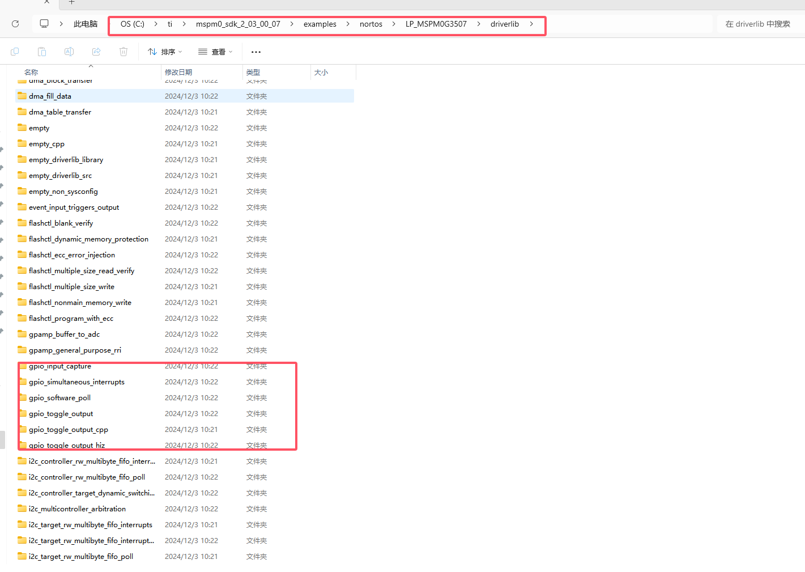
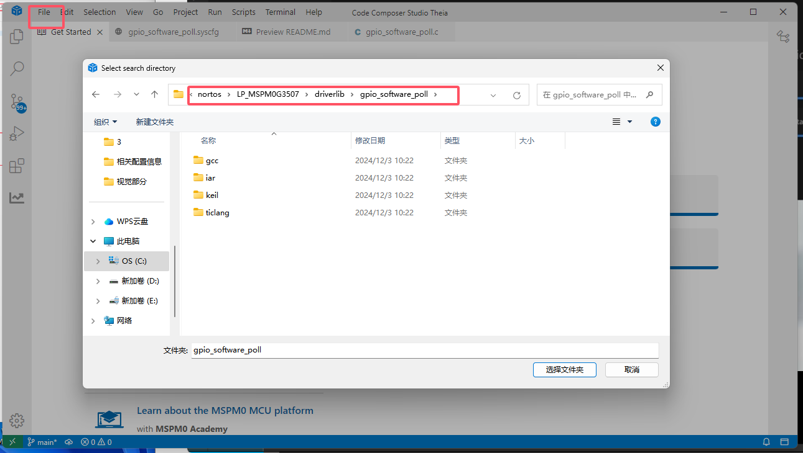
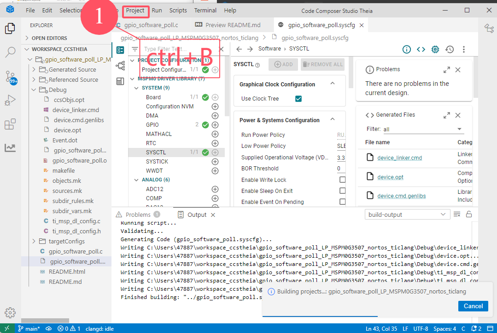
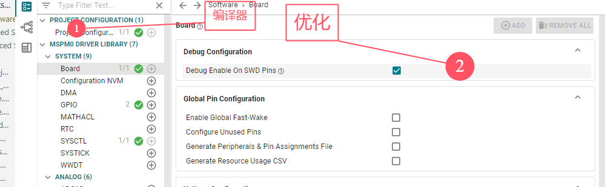
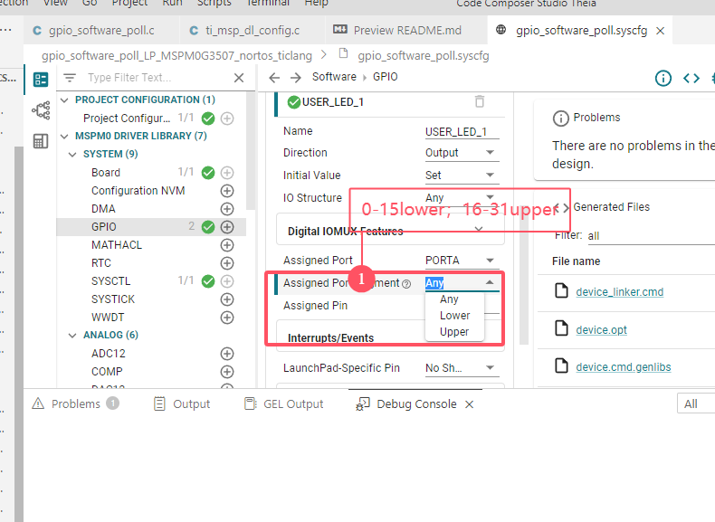
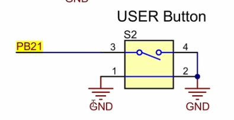
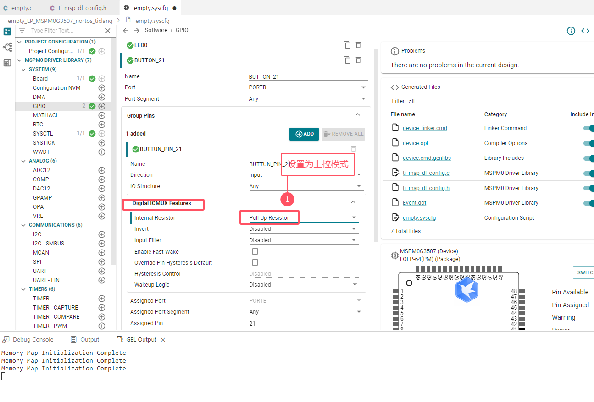
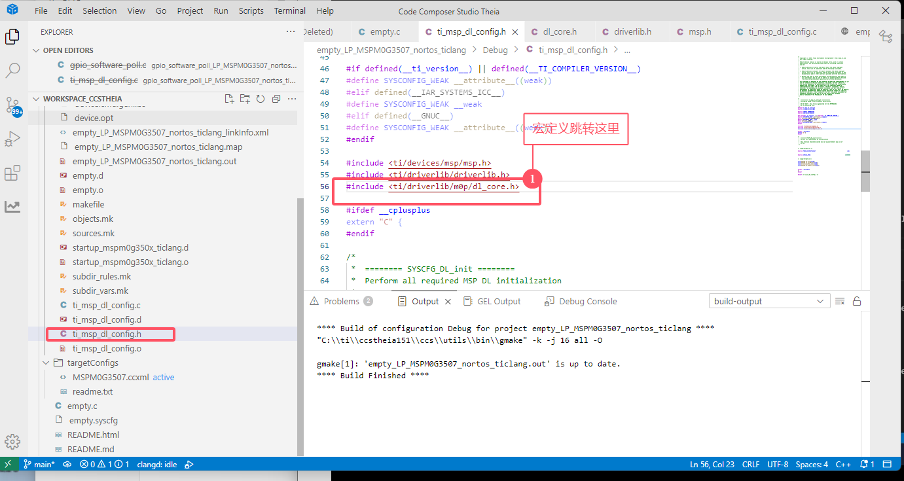
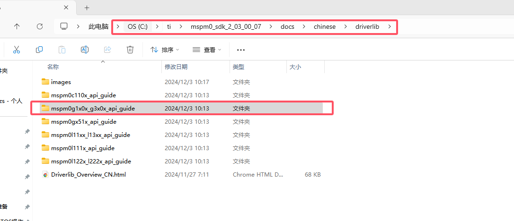
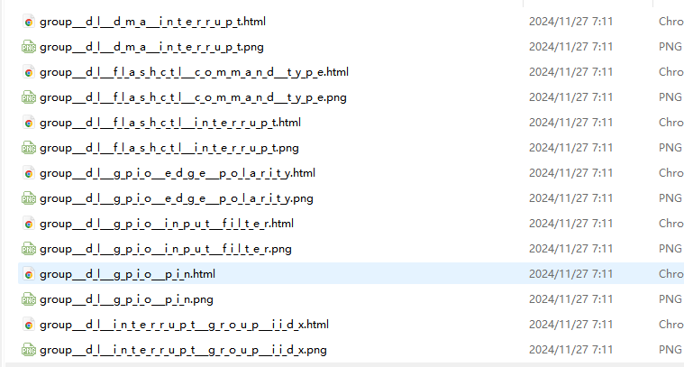

[TI MSPM0快速入门课 - 开发环境部署_哔哩哔哩_bilibili](https://www.bilibili.com/video/BV1Bm421773M?spm_id_from=333.788.videopod.sections&vd_source=2d7e87e134d64e53500a626391df1533)

硬件文档下载：

https://www.ti.com/tool/LP-MSPM0G3507#design-files

# 1、GPIO按键点亮led

## 1、import导入

> 样例如下：



> 导入目录




> 编译文件



> 跳转==ctrl+鼠标左键==





## 2、创建新工程

也是相当于导入的

## 3、按键设置为上拉

> 这里按键没按下去是浮空的状态，需要设置为上拉







## 4、总结：

> 1. 按键设置为上拉，不然是浮空状态
>
> 2. TI相关函数，读、设置高低电平
>
> 3. ctrl+B是编译快捷键
>
> 4. PA0是led灯，PB21是按键S2
>
> 5. 硬件手册下载
>
>    [官网]: https://www.ti.com/tool/LP-MSPM0G3507#design-files
>
> 6. 软件手册，在SDK的doc目录里面

```
DL_GPIO_readPins（）//读电平
DL_GPIO_setPins(GPIO_LEDS_PORT, GPIO_LEDS_USER_LED_1_PIN);//高电平
DL_GPIO_clearPins(GPIO_LEDS_PORT, GPIO_LEDS_USER_LED_1_PIN);//低电平
```








[软件部分的数据手册](file:///C:/ti/mspm0_sdk_2_03_00_07/docs/chinese/driverlib/mspm0g1x0x_g3x0x_api_guide/html/group___g_p_i_o.html#ga42aa9cb95e25e2b52ff12c20f0b9ca1f)