> M0G3507_CMSIS_DSP
>
> - CMSIS-**Cortex Microcontroller Software Interface Standard**——Cortex 微控制器软件接口标准
> - **CMSIS-Core**：处理器内核访问层。
> - **CMSIS-DSP**：数字信号处理库。 **Digital Signal Processing**（数字信号处理）
> - **CMSIS-RTOS**：实时操作系统支持。

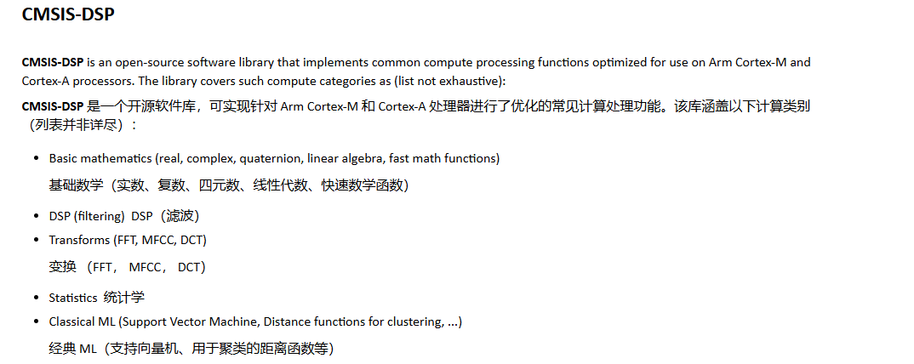

> 1. 百度搜索CMSIS DSP，进入GitHub官网，点击右边的链接。
>
> 2. 或者直接点击下面网址。
>
>    [CMSIS-DSP: Overview](https://arm-software.github.io/CMSIS-DSP/latest/index.html)

# 4 、引用CMSIS DSP

## 4、1 导入工程文件

> 空文件即可

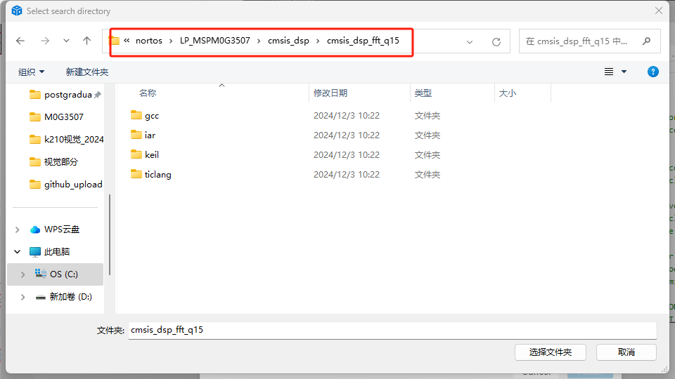

## 4、2 参考网址路径(这里是将CMSIS DSP加入到driverlib里面)

[适用于 MSPM0 MCU 的 CMSIS DSP 库 — CMSIS DSP Library for MSPM0 MCUs 1.7.0 documentation](file:///C:/ti/mspm0_sdk_2_03_00_07/docs/chinese/third_party/cmsis_dsp/doc_guide/doc_guide-srcs/Users_Guide_CN.html)

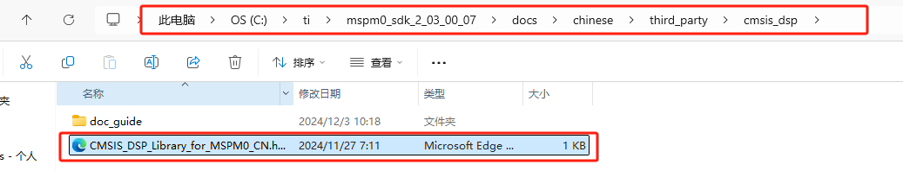

### 4、2、1 添加步骤（加入头文件）

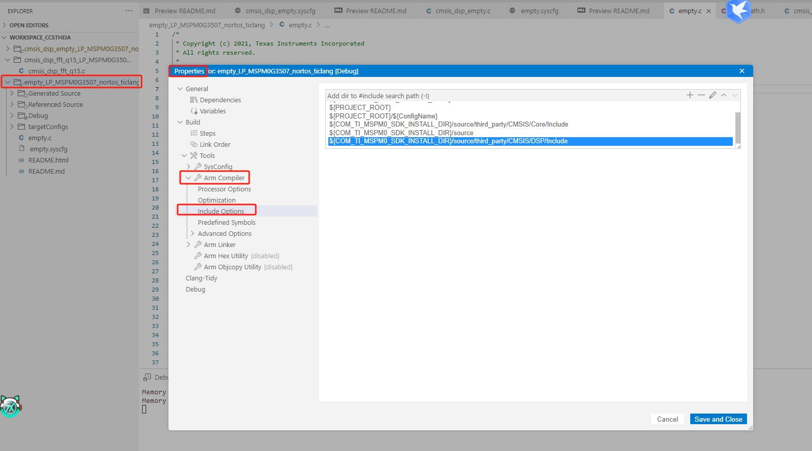

> 添加的路径是下面的路径

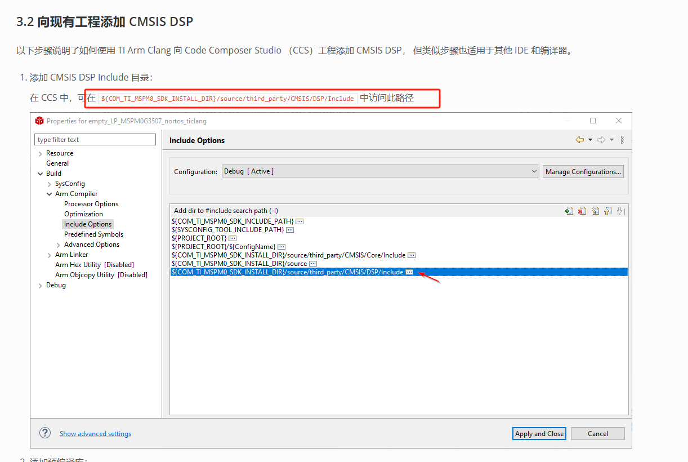

### 4、2、2 第二步，添加编译文件

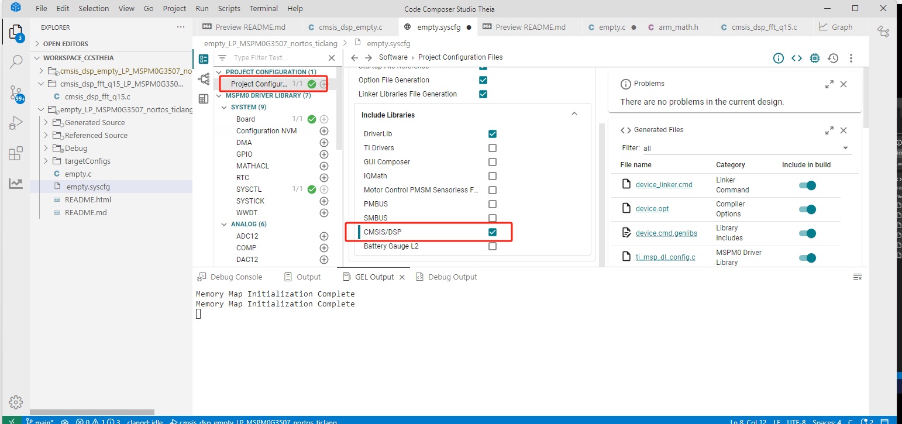

### 4、2、3 第三步，添加math.h文件，剩下的和下面步骤一样

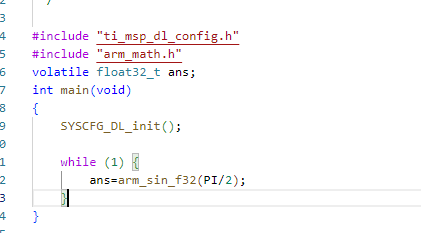

```c
#include "ti_msp_dl_config.h"
#include "arm_math.h"
volatile float32_t ans;
int main(void)
{
    SYSCFG_DL_init();

    while (1) {
        ans=arm_sin_f32(PI/2);
    }
}
```

## 4、3 运行样例，然后图形化输出

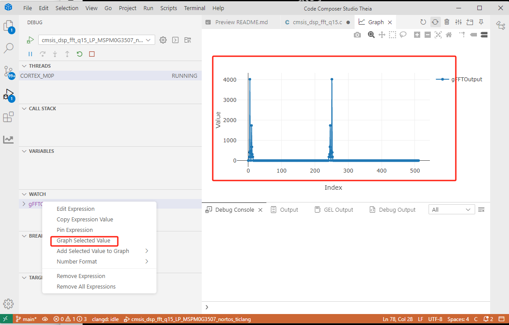

> readme.md里面有解释

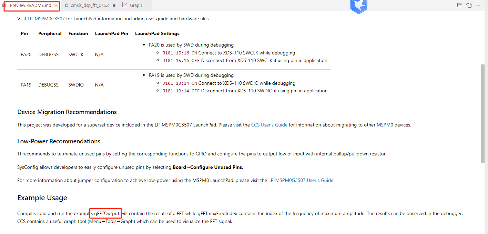

## 4、4 导入empty文档

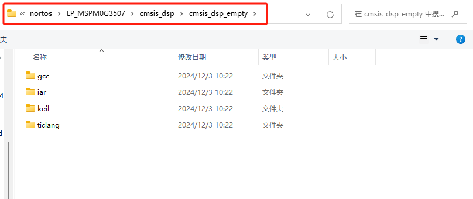

>  进入网址：[CMSIS-DSP: Overview](https://arm-software.github.io/CMSIS-DSP/latest/index.html)

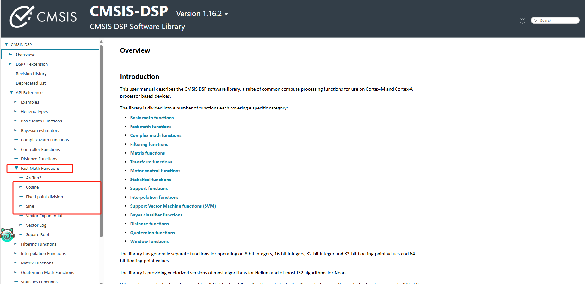

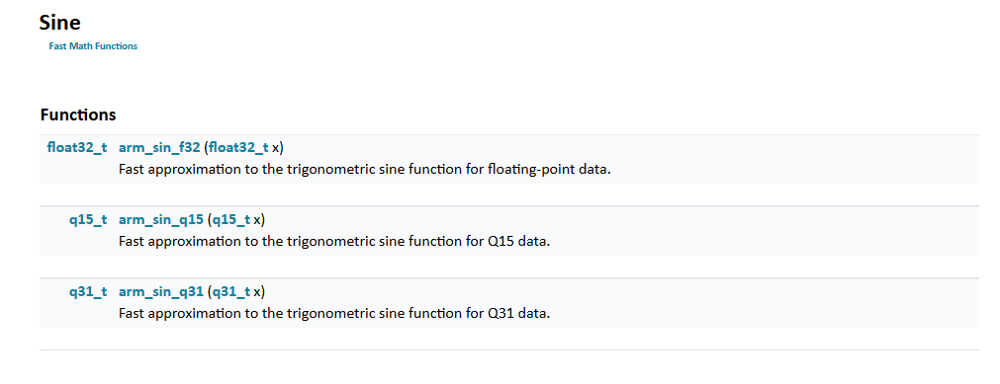

## 4、5 编写函数计算PI\4的正弦

> 这里的PI在math.h里面定义过了，直接用就行

```c
#include "arm_math.h"
#include "ti_msp_dl_config.h"

volatile float32_t ans;
int main(void)
{
    SYSCFG_DL_init();

    while (1) {
        ans=arm_sin_f32(PI/2);
    }
}
```

# 总结

> 1. CMSIS-DSP 是信号处理库
> 2. 可以在driverlib里面引用，包含头文件、编译文件的添加
> 3. 一些数据可以在调试的时候用图形化的形式表示出来
> 4. DSP处理库，在github官网右边链接：[CMSIS-DSP: Overview](https://arm-software.github.io/CMSIS-DSP/latest/index.html)

```c
#include "arm_math.h"
volatile float32_t ans;
ans=arm_sin_f32(PI/2);
```


