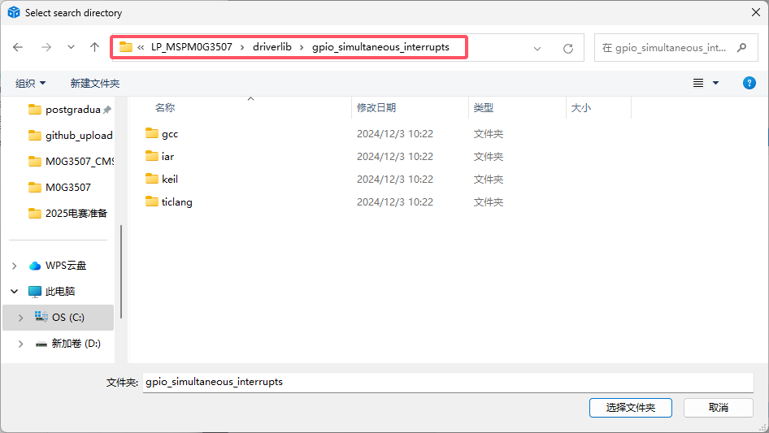
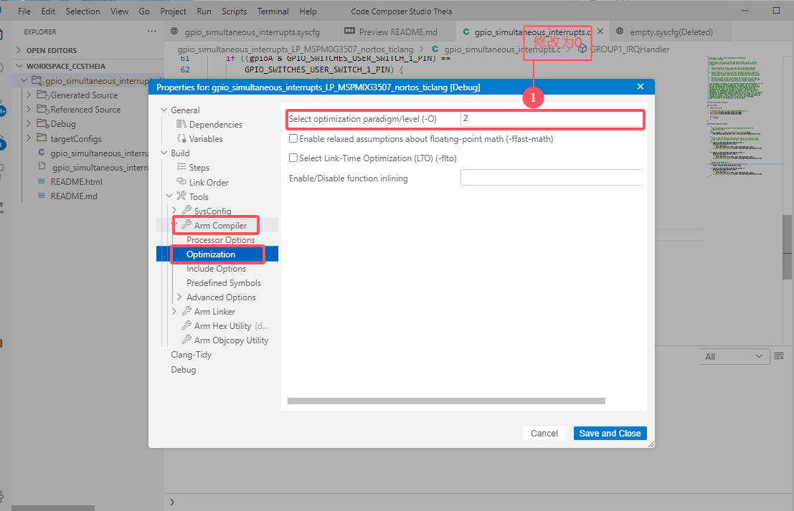
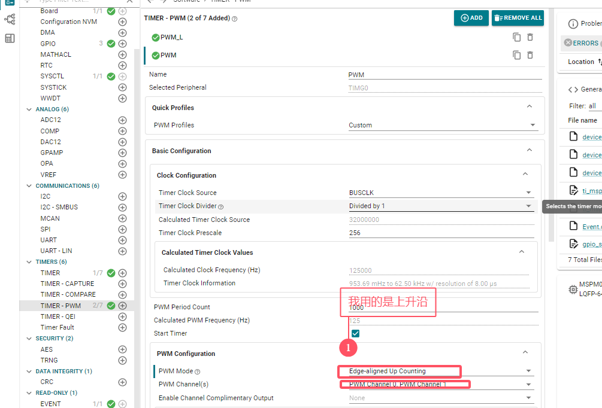
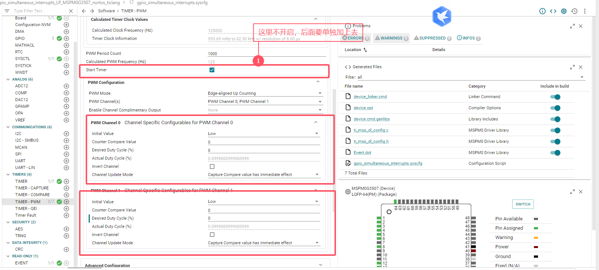
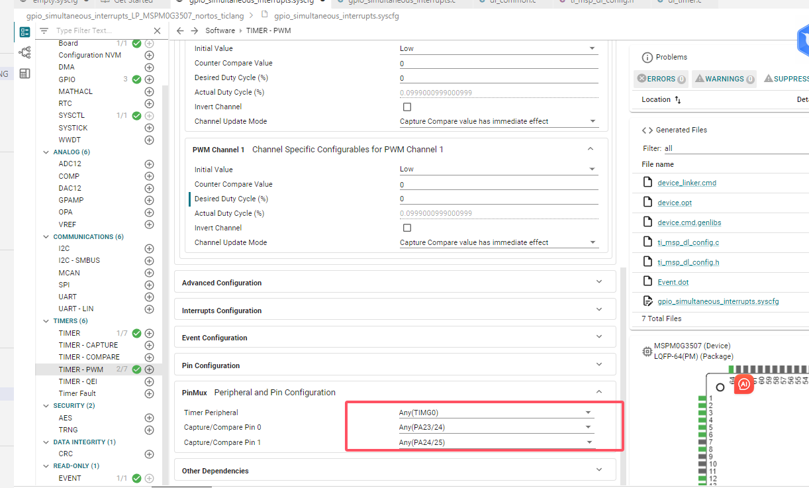
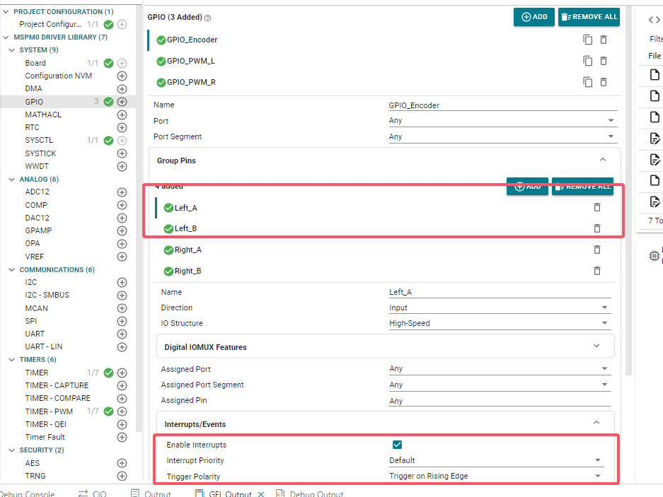
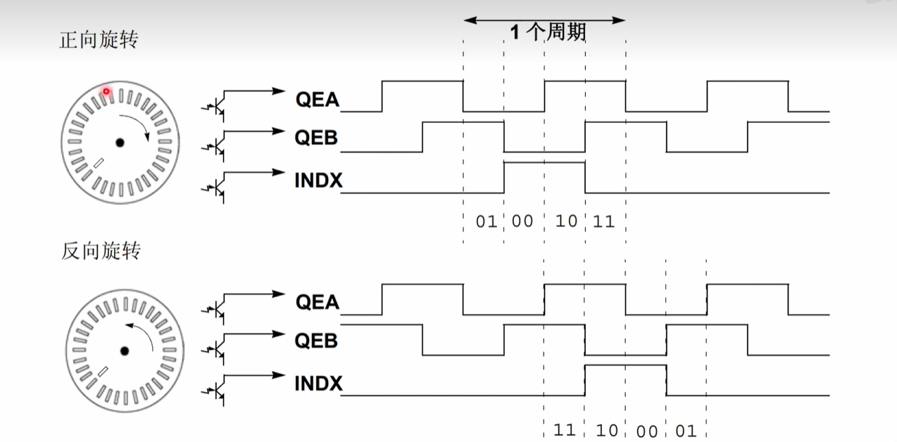
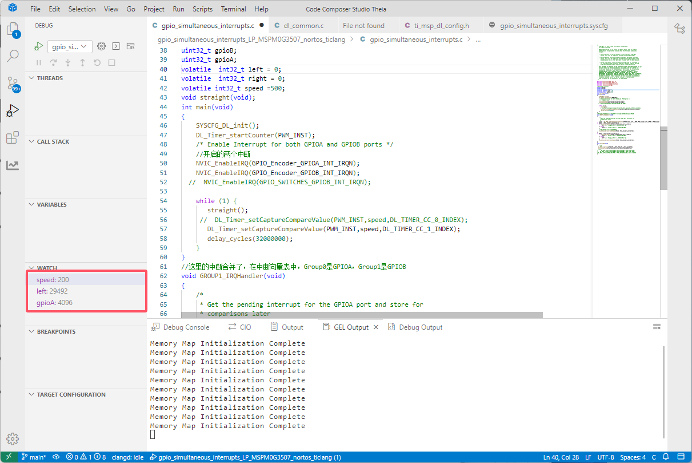
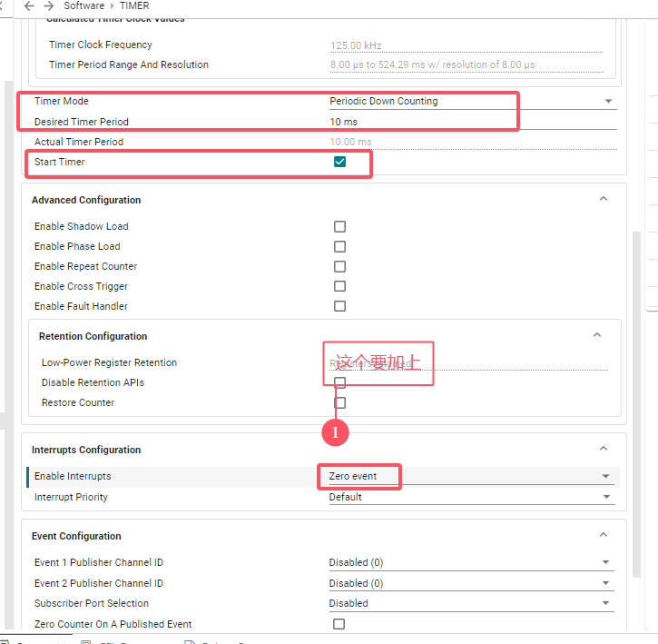
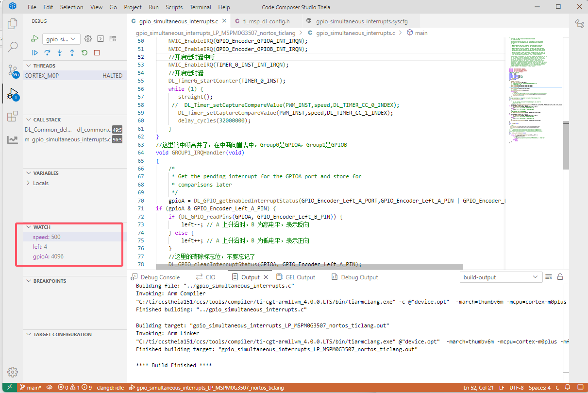

# 7、Encoder

> void GROUP1_IRQHandler(void)，中断组合并了，Group0和Group1合并了。

## 7、1  导入工程，基本配置

> 导入工程



> 取消编译优化，可以看见局部变量（但是我这里好像不行，我换回了全局变量）



## 7、2 PWM的配置

<font color="red">注意这里的值是0-999（加入计数值是1000）</font>

> 我用的是上升沿，刚好将速度映射到0-999（0是停止，999速度最大）





> 注意用的是哪个定时器，如果是TimerG和TimerA在给占空比的时候函数有差别。



> 1. （上面没开启定时器的）需要单独加上开启定时器的函数。
> 2. 定时器不同的，用不同的set。

```c
int main(void)
{
    SYSCFG_DL_init();
    DL_TimerG_startCounter(PWM_INST);
 //   DL_TimerG_startCounter(PWM_R_INST);
    /* Enable Interrupt for both GPIOA and GPIOB ports */
    //开启的两个中断
    //NVIC_EnableIRQ(GPIO_SWITCHES_GPIOA_INT_IRQN);
   // NVIC_EnableIRQ(GPIO_SWITCHES_GPIOB_INT_IRQN);
    
    while (1) {
       DL_TimerG_setCaptureCompareValue(PWM_INST,speed,DL_TIMER_CC_0_INDEX);
       DL_TimerG_setCaptureCompareValue(PWM_INST,speed,DL_TIMER_CC_1_INDEX);
       delay_cycles(32000000);
    }
}
```

## 7、3 编码器测速（不加定时器）

### 7、3、1配置外部中断引脚测速

> 开启外部中断，<font color="red">NVIC和clear</font>,这两个步骤不能漏了



> 两相的测速，下面是逻辑代码

```c
void GROUP1_IRQHandler(void)
{
    /*
     * Get the pending interrupt for the GPIOA port and store for
     * comparisons later
     */
    gpioA = DL_GPIO_getEnabledInterruptStatus(GPIO_Encoder_Left_A_PORT,GPIO_Encoder_Left_A_PIN | GPIO_Encoder_Left_B_PIN);
if (gpioA & GPIO_Encoder_Left_A_PIN) {
    if (DL_GPIO_readPins(GPIOA, GPIO_Encoder_Left_B_PIN)) {
        left--; // A 上升沿时，B 为高电平，表示反向
    } else {
        left++; // A 上升沿时，B 为低电平，表示正向
    }
    //这里的清除标志位，不要忘记了
    DL_GPIO_clearInterruptStatus(GPIOA, GPIO_Encoder_Left_A_PIN);
}
if (gpioA & GPIO_Encoder_Left_B_PIN) {
    if (DL_GPIO_readPins(GPIOA, GPIO_Encoder_Left_A_PIN)) {
        left++; // B 上升沿时，A 为高电平，表示正向
    } else {
        left--; // B 上升沿时，A 为低电平，表示反向
    }
    DL_GPIO_clearInterruptStatus(GPIOA, GPIO_Encoder_Left_B_PIN);
}
}
```

> 编码器测速原理：



> 结果如下：



### 注意事项

> 1. 需要开启NVIC的中断。
> 2. 需要清除中断标志位。

```c
//清除中断标志位
DL_GPIO_clearInterruptStatus(GPIOA, GPIO_Encoder_Left_B_PIN);
//开启外部中断
NVIC_EnableIRQ(GPIO_Encoder_GPIOA_INT_IRQN);
```

## 7、4 定时器编码器测速、

### 7、4、1 定时器配置

> 这里按着图配置就行，别漏了标序号的位置



### 7、4、2 代码及结果

>  开启NVIC中断，开启定时器

```c
//定时器中断，这里每隔10ms更新
void TIMER_0_INST_IRQHandler(void)
{
    switch (DL_TimerG_getPendingInterrupt(TIMER_0_INST)) {
        case DL_TIMER_IIDX_ZERO:
            left=0;
          //  DL_TimerG_clearInterruptStatus(TIMER_0_INST); // 清除中断标
            break;
        default:
            break;
    }
}
```

> 结果如下。



# 总结（定时器编码器）

> 1. pwm的配置注意定时器的序号，这里的序号好像都改成了这种函数`DL_Timer_startCounter`、`DL_Timer_setCaptureCompareValue`。
> 2. 外部中断编码器测速，因为M0只有一组QEI，`这里不要忘记清除外部中断的标志位`。
> 3. 定时器的中断，`下面的事件也需要添加`。


# 代码：

```c
#include "ti/driverlib/dl_gpio.h"
#include "ti/driverlib/dl_timerg.h"
#include "ti/driverlib/m0p/dl_core.h"
#include "ti_msp_dl_config.h"
//#include <cstdint>
uint32_t gpioB;
uint32_t gpioA;
volatile  int32_t left = 0;
volatile  int32_t right = 0;
volatile int32_t speed =500;
void straight(void);
int main(void)
{
    SYSCFG_DL_init();
    DL_Timer_startCounter(PWM_INST);
    /* Enable Interrupt for both GPIOA and GPIOB ports */
    //开启的两个外部中断
    NVIC_EnableIRQ(GPIO_Encoder_GPIOA_INT_IRQN);
    NVIC_EnableIRQ(GPIO_Encoder_GPIOB_INT_IRQN);
    //开启定时器中断
    NVIC_EnableIRQ(TIMER_0_INST_INT_IRQN);
    //开启定时器
    DL_TimerG_startCounter(TIMER_0_INST);
    while (1) {
       straight();
     //  DL_Timer_setCaptureCompareValue(PWM_INST,speed,DL_TIMER_CC_0_INDEX);
       DL_Timer_setCaptureCompareValue(PWM_INST,speed,DL_TIMER_CC_1_INDEX);
       delay_cycles(32000000);
    }
}
//这里的中断合并了，在中断向量表中，Group0是GPIOA，Group1是GPIOB
void GROUP1_IRQHandler(void)
{
    /*
     * Get the pending interrupt for the GPIOA port and store for
     * comparisons later
     */
    gpioA = DL_GPIO_getEnabledInterruptStatus(GPIO_Encoder_Left_A_PORT,GPIO_Encoder_Left_A_PIN | GPIO_Encoder_Left_B_PIN);
if (gpioA & GPIO_Encoder_Left_A_PIN) {
    if (DL_GPIO_readPins(GPIOA, GPIO_Encoder_Left_B_PIN)) {
        left--; // A 上升沿时，B 为高电平，表示反向
    } else {
        left++; // A 上升沿时，B 为低电平，表示正向
    }
    //这里的清除标志位，不要忘记了
    DL_GPIO_clearInterruptStatus(GPIOA, GPIO_Encoder_Left_A_PIN);
}
if (gpioA & GPIO_Encoder_Left_B_PIN) {
    if (DL_GPIO_readPins(GPIOA, GPIO_Encoder_Left_A_PIN)) {
        left++; // B 上升沿时，A 为高电平，表示正向
    } else {
        left--; // B 上升沿时，A 为低电平，表示反向
    }
    DL_GPIO_clearInterruptStatus(GPIOA, GPIO_Encoder_Left_B_PIN);
}
}
void straight(void)
{
    //左轮
  DL_GPIO_clearPins(GPIO_PWM_L_PORT,GPIO_PWM_L_GPIO_pwmL0_PIN);
  DL_GPIO_setPins(GPIO_PWM_L_PORT,GPIO_PWM_L_GPIO_pwmL1_PIN);
  //右轮
//     DL_GPIO_setPins(GPIO_PWM_R_PORT,GPIO_PWM_R_GPIO_pwmR0_PIN);
//   DL_GPIO_clearPins(GPIO_PWM_R_PORT,GPIO_PWM_R_GPIO_pwmR1_PIN);
//DL_GPIO_setPins(GPIO_LEDS_PORT, GPIO_LEDS_USER_LED_1_PIN);//高电平
}
void TIMER_0_INST_IRQHandler(void)
{
    switch (DL_TimerG_getPendingInterrupt(TIMER_0_INST)) {
        case DL_TIMER_IIDX_ZERO:
            left=0;
          //  DL_TimerG_clearInterruptStatus(TIMER_0_INST); // 清除中断标
            break;
        default:
            break;
    }
}
```

# 引脚：

PWM-PA24

GPIO_pwmL0-PB7

GPIO_pwmL1-PB8

---

> 外部中断引脚

GPIO_Encoder:

Left_A-PA13

Left_B-PA12

