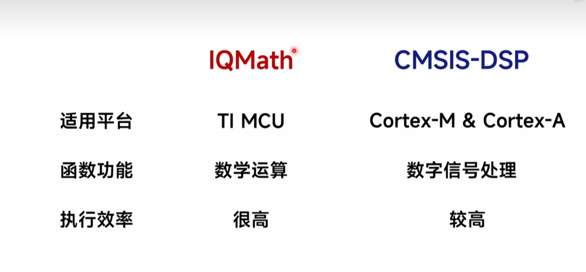
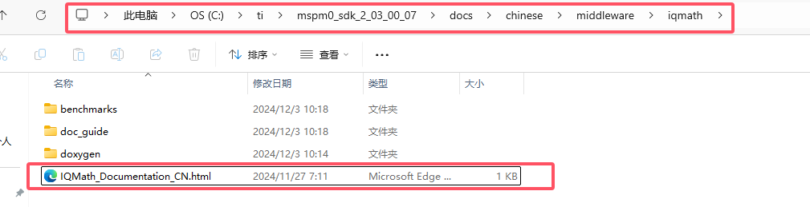
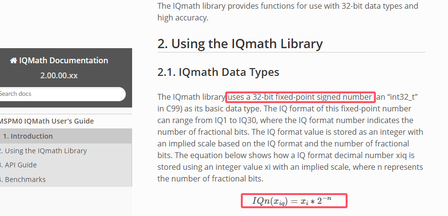
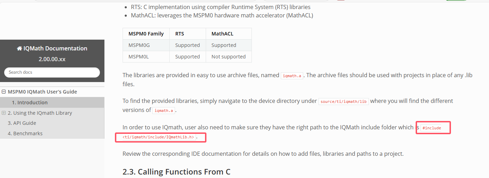
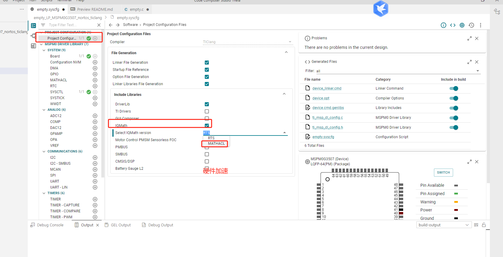
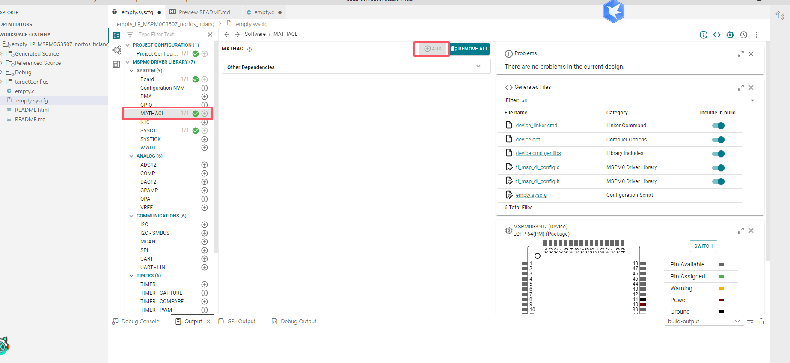
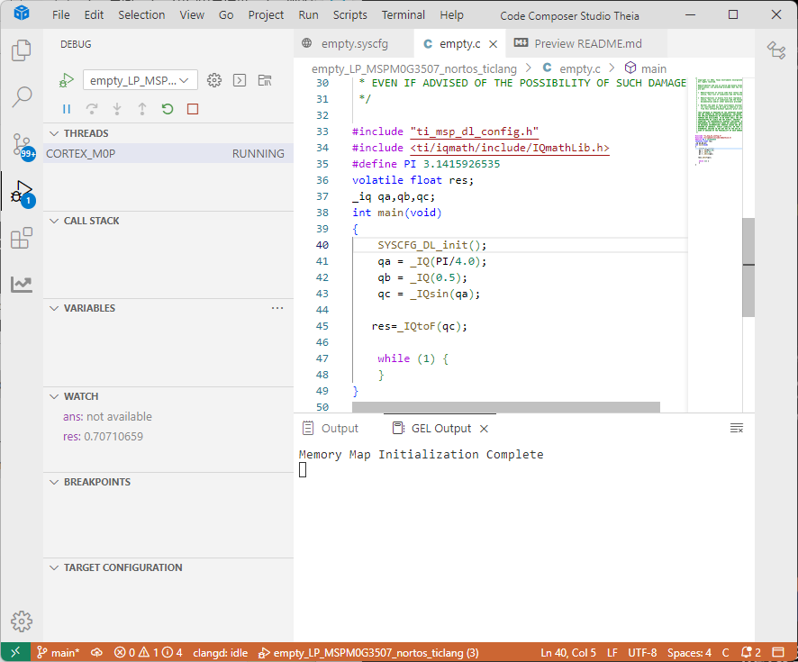
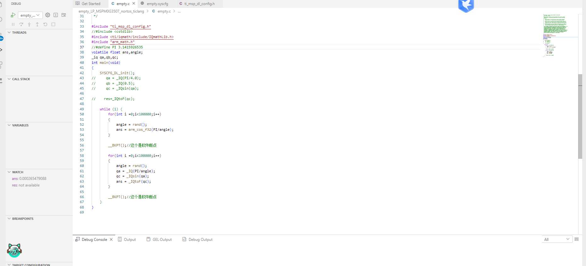

# 5、IQMath

> 和CMSIS-DSP之间的区别



## 5、1参考文档

[MSPM0 IQMath User’s Guide — IQMath Documentation 2.00.00.xx documentation](file:///C:/ti/mspm0_sdk_2_03_00_07/docs/chinese/middleware/iqmath/doc_guide/doc_guide-srcs/Users_Guide_CN.html#introduction)



## 5、2 引用及应用

> 这里需要将浮点数转化为定点数进行运算（后面又需要将定点数转化为浮点数），下面的_IQ前缀就是转化。



### 5、2、1 加入头文件

> 加入头文件



```c
 #include <ti/iqmath/include/IQmathLib.h>
```

### 5、2、2 修改配置文件（预编译_添加两步_）





# 5、3 编写代码，调试运行

> 简单三角函数运算（*结果是有精度的，后面是估算*）



```c
#include "ti_msp_dl_config.h"
#include <ti/iqmath/include/IQmathLib.h>
#define PI 3.1415926535
volatile float res;
_iq qa,qb,qc;
int main(void)
{
    SYSCFG_DL_init();
    qa = _IQ(PI/4.0);
    qb = _IQ(0.5);
    qc = _IQsin(qa);
   
   res=_IQtoF(qc);

    while (1) {
    }
}

```

# 5、4 比较IQMath和CMSIS-DSP

${COM_TI_MSPM0_SDK_INSTALL_DIR}/source/third_party/CMSIS/DSP/Include

> 编写代码，下面代码比上面快了估计一倍



> 代码如下，其中的引用头文件、配置文件里面的预编译文件同上添加

```c
#include "ti_msp_dl_config.h"
//#include <cstdlib>
#include <ti/iqmath/include/IQmathLib.h>
#include "arm_math.h"
//#define PI 3.1415926535
volatile float ans,angle;
_iq qa,qb,qc;
int main(void)
{
    SYSCFG_DL_init();
//     qa = _IQ(PI/4.0);
//     qb = _IQ(0.5);
//     qc = _IQsin(qa);
   
//    res=_IQtoF(qc);

    while (1) {
        for(int i =0;i<100000;i++)
        {
            angle = rand();
            ans = arm_cos_f32(PI/angle);
        }

        __BKPT();//这个是软件断点

        for(int i =0;i<100000;i++)
        {
            angle = rand();
            qa = _IQ(PI/angle);
            qc = _IQsin(qa);
            ans = _IQtoF(qc);
        }

        __BKPT();//这个是软件断点
    }
}
```

# 总结

> 1. IQMath的文档在docs里面，这里只需要在sys的配置文件里面添加就行，选择硬件加速，**然后需要再次勾选硬件加速选项**。
> 2. IQMath的运算的数据需要时定点数，这里_IQ为前缀的是将浮点数转化为定点数，最后定点数需要转化回浮点数。
> 3. __BKPT()//ARM里面的软件断点，用作调试。