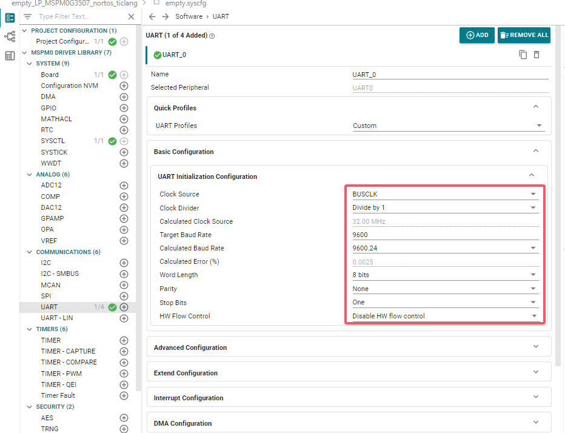
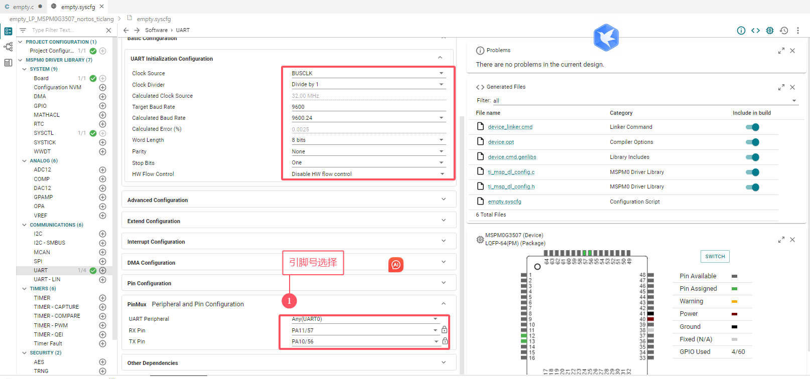
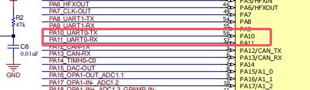
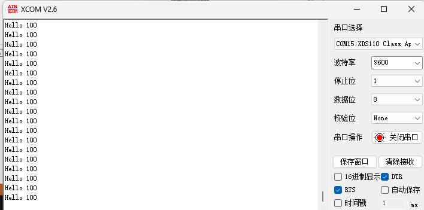
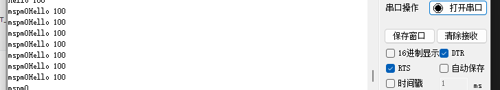
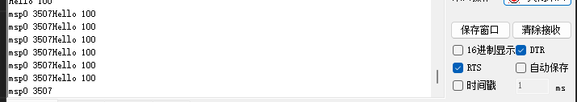

# 6、printf重定向

> 硬件手册：https://www.ti.com/tool/LP-MSPM0G3507#design-files 

## 6、1 进行串口UART0的配置

> 导入空白工程之后，进行UART0的默认配置



> 引脚号选择，PA10和PA11





## 6、2 代码编写

> 只重新向fputc的话，printf不能打印参数，一般是三个都需要重定向

```c
#include "ti/driverlib/dl_uart_main.h"
#include "ti/driverlib/m0p/dl_core.h"
#include "ti_msp_dl_config.h"
#include "stdio.h"
#include "string.h"
//#include <cstdio>
//#include <cstdint>
//#include <cstdio>
int a=100;
// int fputc(int c,FILE* stream);
// int fputs(const char* restrict s,FILE* restrict stream);
// int puts(const char*_ptr);
int main(void)
{
    SYSCFG_DL_init();

    while (1) {
        printf("Hello %d\r\n",a);
        delay_cycles(32000000);
    }
}
int fputc(int c,FILE* stream)
{
    DL_UART_Main_transmitDataBlocking(UART_0_INST,c);
    return c;
}
//如果只定义上面一个函数的话，那么printf不能打印参数
//下面两个重定向就一起重定向
int fputs(const char* restrict s,FILE* restrict stream)
{
    uint16_t i,len;
    len=strlen(s);
    for(i=0;i<len;i++)
    {
        DL_UART_Main_transmitDataBlocking(UART_0_INST,s[i]);
    }
    return len;
}
int puts(const char*_ptr)
{
    int count = fputs(_ptr,stdout);
    count+=fputs("\n",stdout);
    return count;
}
```

> 结果如下：



## 6、3 SendString、Sprintf

> 代码编写

```c
Sendtring("mspm0\r\n");
#include "ti/driverlib/dl_uart_main.h"
#include "ti/driverlib/m0p/dl_core.h"
#include "ti_msp_dl_config.h"
#include "stdio.h"
#include "string.h"
//#include <cstdio>
//#include <cstdint>
//#include <cstdio>
int a=100;
char txBuff[100];
void Sendtring(char *str);
// int fputc(int c,FILE* stream);
// int fputs(const char* restrict s,FILE* restrict stream);
// int puts(const char*_ptr);
int main(void)
{
    SYSCFG_DL_init();

    while (1) {
        printf("Hello %d\r\n",a);
        sprintf(txBuff,"msp0 %d",3507);
        // Sendtring("mspm0\r\n");
        Sendtring(txBuff);
        delay_cycles(32000000);
    }
}
int fputc(int c,FILE* stream)
{
    DL_UART_Main_transmitDataBlocking(UART_0_INST,c);
    return c;
}
//如果只定义上面一个函数的话，那么printf不能打印参数
//下面两个重定向就一起重定向
int fputs(const char* restrict s,FILE* restrict stream)
{
    uint16_t i,len;
    len=strlen(s);
    for(i=0;i<len;i++)
    {
        DL_UART_Main_transmitDataBlocking(UART_0_INST,s[i]);
    }
    return len;
}
int puts(const char*_ptr)
{
    int count = fputs(_ptr,stdout);
    count+=fputs("\n",stdout);
    return count;
}
void Sendtring(char *str)
{
    while(*str!='\0')
    {
        DL_UART_Main_transmitDataBlocking(UART_0_INST,*str++);
    }
}
```

> 结果如下：



> sprintf，将要发的数据存储，然后发送，结果如下




# 总结

> 1. 重定向需要重写三个函数，只重写fputc的话，不能传递参数。
> 2. 这里的串口号用的是PA10和PA11。
> 3. sprintf重定向，可以直接改串口，利用多个。