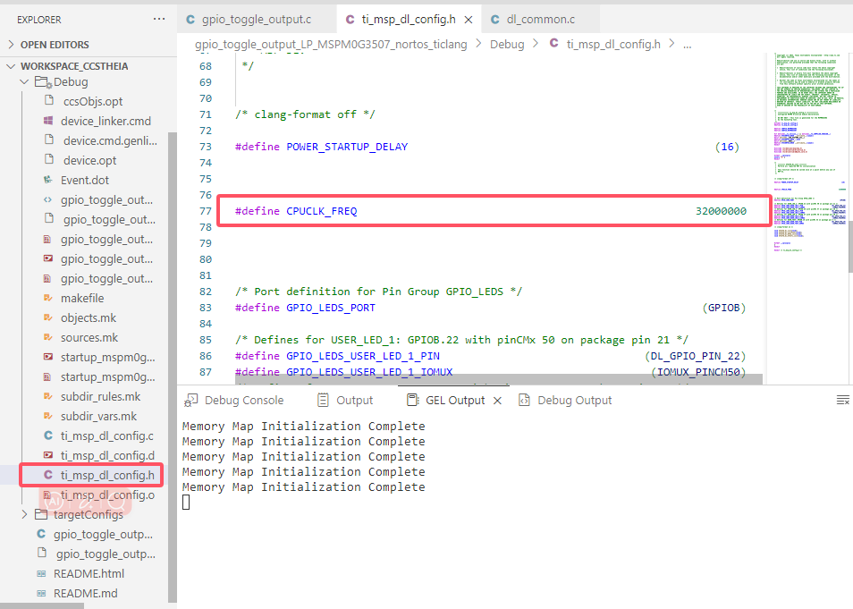
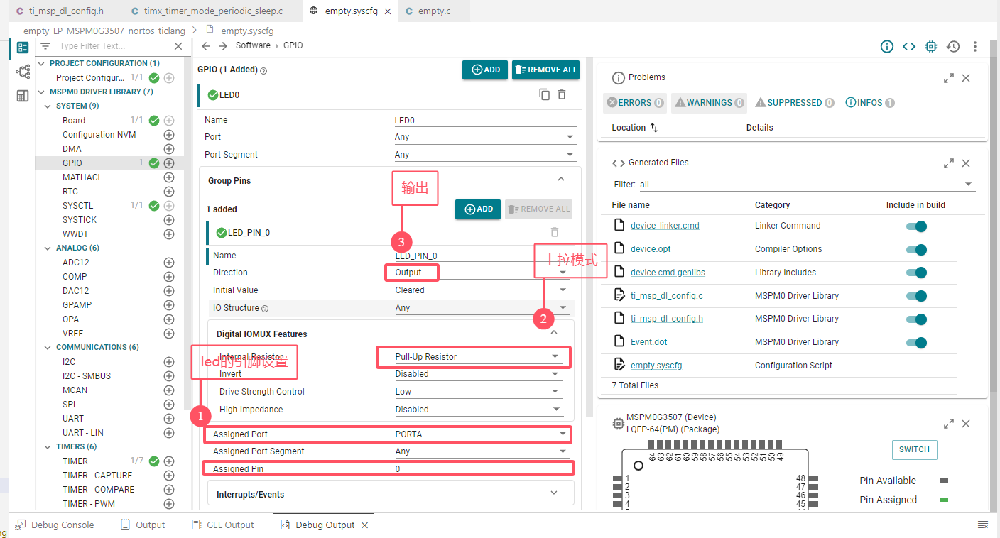
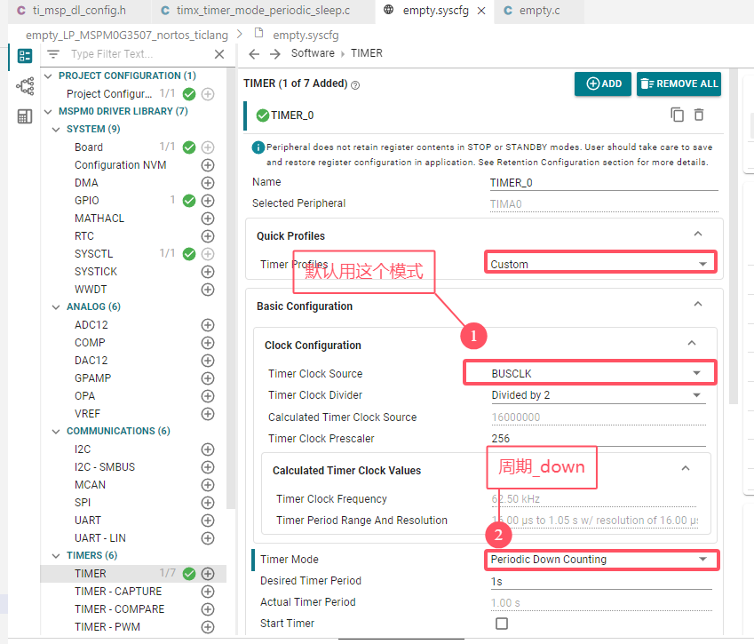
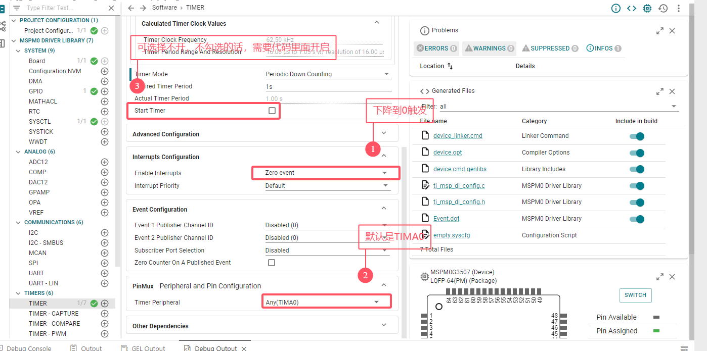
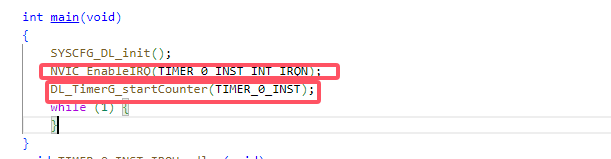

# 2、Time定时器反转led

## 2、1 延时函数

> 延时函数

```c
//这里的系统主频是32MHZ
void delay_ms(uint32_t ms)
{
    delay_cycles(CPUCLK_FREQ/1000);
}
```



## 2、2  GPIO_led配置

> 按照图片配置就行



## 2、3 定时器配置

> 每1s进入一次定时中断



> 中断方式，周期下降



## 2、3 main函数编写

> 初始化配置，开启NVIC中断，开启定时器TIMA0



```c
    NVIC_EnableIRQ(TIMER_0_INST_INT_IRQN);
    DL_TimerG_startCounter(TIMER_0_INST);
```

## 2、4 TIMER_0_INST 中断配置

```c
void TIMER_0_INST_IRQHandler(void)
{
    switch (DL_TimerG_getPendingInterrupt(TIMER_0_INST)) {
        case DL_TIMER_IIDX_ZERO:
            DL_GPIO_togglePins(LED0_PORT,
                LED0_LED_PIN_0_PIN);
            break;
        default:
            break;
    }
}
```

# 总结：

> 1. 定时器有A、G、X三种，A为后缀是高级；G为后缀是通用；X为后缀是混合（例如TIMA0，就是高级定时器）
> 2. Time的时钟源选择BUSCLK，其他配置按需求来就行

```c
delay_cycles(CPUCLK_FREQ/1000);
//电平翻转
DL_GPIO_togglePins(GPIO_LEDS_PORT, GPIO_LEDS_USER_TEST_PIN);
//开启NVIC中断
NVIC_EnableIRQ(TIMER_0_INST_INT_IRQN);
//开启定时器
DL_TimerG_startCounter(TIMER_0_INST);
//定时中断函数
DL_TimerG_getPendingInterrupt(TIMER_0_INST)
void TIMER_0_INST_IRQHandler(void)
{
    switch (DL_TimerG_getPendingInterrupt(TIMER_0_INST)) {
        case DL_TIMER_IIDX_ZERO:
            DL_GPIO_togglePins(LED0_PORT,
                LED0_LED_PIN_0_PIN);
            break;
        default:
            break;
    }
}
```

