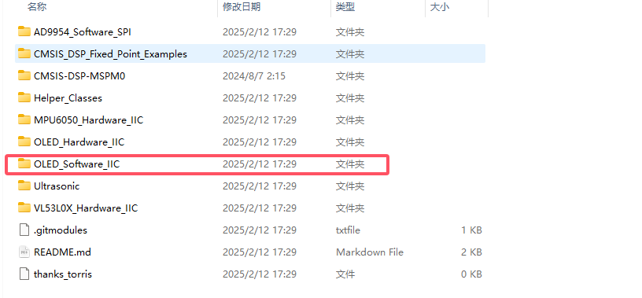
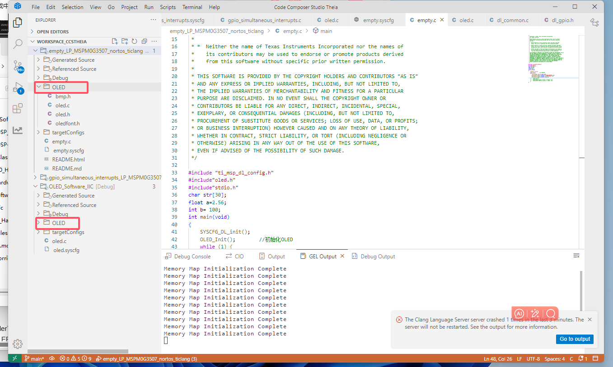
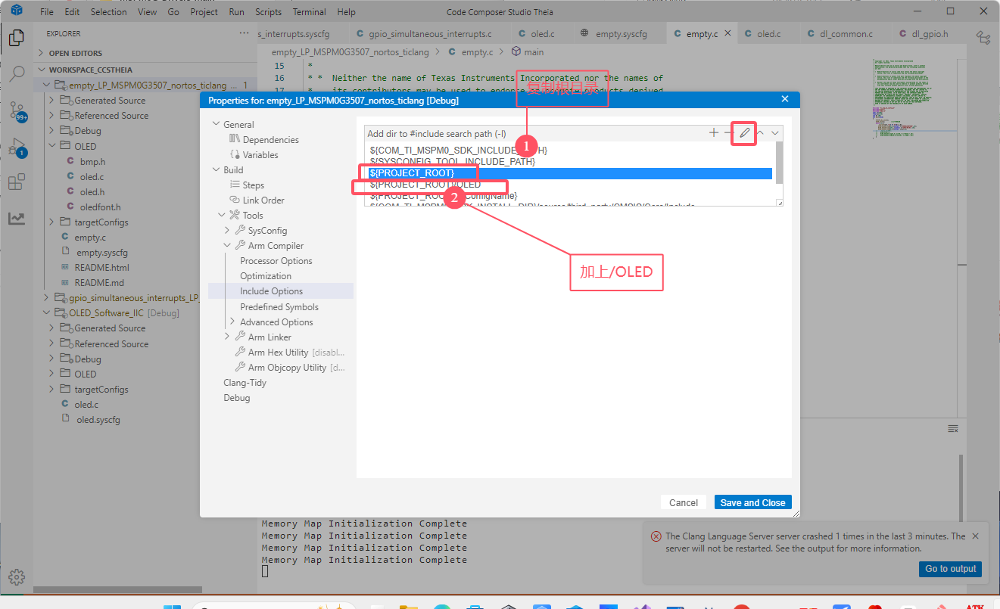
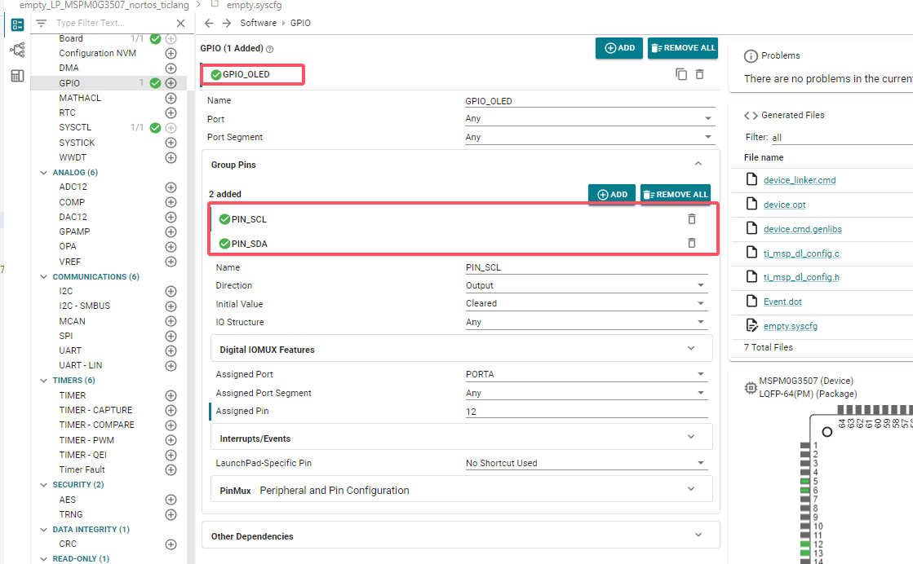

# 9、oled软件IIC

## 9 、1 下载源码：

Gitee：https://gitee.com/torris-yin/MSPM0G_Drivers 

Github：https://github.com/Torris-Yin/MSPM0G_Drivers



## 9、2配置步骤：

> 将OLED的文件复制到需要移植的文件中



> 将头文件包含在项目中：、
>
> 1. 右键属性
> 2. 包含OLED路径



> 配置sys配置文件：这里随便哪个引脚都可以，但是引脚名字要一一对应。
>
> 1. GPIO_OLED
> 2. PIN_SCL
> 3. PIN_SDA



## 9、3 显示变量（sprintf）

```c
#include "ti_msp_dl_config.h"
#include"oled.h"
#include"stdio.h"
char str[30];
float a=2.56;
int b= 100;
int main(void)
{
    SYSCFG_DL_init();
    OLED_Init();		//初始化OLED
    while (1) {
        sprintf(str,"a=%.2f b=%d",a,b);
       OLED_ShowString(8,2,(uint8_t *)"ZHONGJINGYUAN",16);
       OLED_ShowString(20,4,(uint8_t *)"2014/05/01",16);
       OLED_ShowString(0,6,(uint8_t *)str,8);  
    //     delay_ms(500);
    //    OLED_Clear();
    //    OLED_ShowString(0,6,(uint8_t *)"ASCII:",16);  
    //    OLED_ShowString(63,6,(uint8_t *)"CODE:",16);
    }
}
```

# 总结

> 1. 将OLED文件复制到所需要的目录里面。
> 2. 配置属性文件sys（软件IIC的引脚任意）。
> 3. sprintf显示变量。
> 4. 如果出现乱码，将优化等级2改成0。