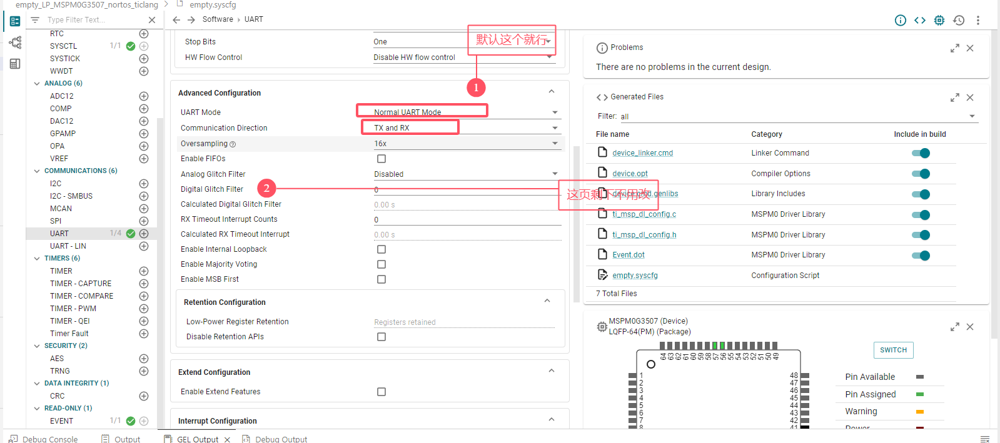
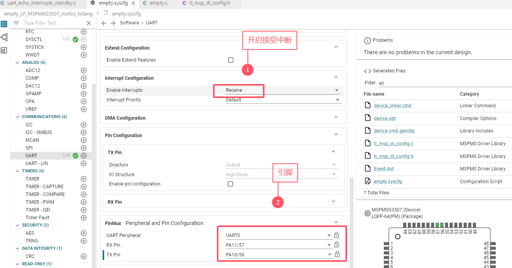

# 3 、usart串口控制反转led


## 3、1 引入参考代码


## 3、2 usart 基本配置

> 配置波特率和时钟源




> 开启接收中断，配置引脚，这列的是J101——PCB板子上的



## 3、3 代码

> 开启NVIC串口中断，使能串口中断


> 串口中断函数编写，这里功能是：接受一次数据，反转一次led


# 总结

> 1. 用USB线连接的串口，引脚是PA10和PA11，这里再J101——pcb图上可以看到
> 2. 开启NVIC和使能串口中断是IRQ类型的

```c
//串口发送函数
DL_UART_Main_transmitData(UART_0_INST, gEchoData);
//串口中断判断
DL_UART_Main_getPendingInterrupt(UART_0_INST);
//串口接收函数
DL_UART_Main_receiveData(UART_0_INST);
//串口中断
void UART_0_INST_IRQHandler(void)
{
    switch (DL_UART_Main_getPendingInterrupt(UART_0_INST)) {
        case DL_UART_MAIN_IIDX_RX:
            DL_GPIO_togglePins(GPIO_LEDS_PORT,
                GPIO_LEDS_USER_LED_1_PIN | GPIO_LEDS_USER_TEST_PIN);
            gEchoData = DL_UART_Main_receiveData(UART_0_INST);
            DL_UART_Main_transmitData(UART_0_INST, gEchoData);
            break;
        default:
            break;
    }
}
```

